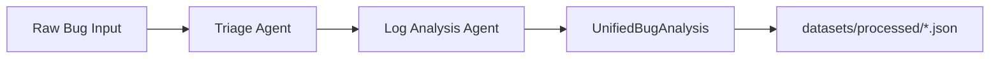

# Creation-of-Intelligent-Bug-Diagnosis-Platform-with-Fix-Recommendation-Assistance

An intelligent pipeline that automatically triages, analyzes, and provides fix suggestions for software bugs.

Creation-of-Intelligent-Bug-Diagnosis-Platform-with-Fix-Recommendation-Assistance combines a FastAPI backend, LangChain-powered agents, Retrieval-Augmented Generation (RAG), and a React dashboard to ingest bug reports, classify severity, parse logs, detect duplicates, identify root causes, and recommend remediation steps.

---

## Project Overview

When a developer or QA engineer submits a bug (paste or file upload), the system:

1. **Ingests** raw bug content into `datasets/raw/` or via the REST API.
2. **Triages** priority, component, and business impact using the Triage Agent.
3. **Parses logs** for errors, stack traces, and HTTP signals using the Log Analysis Agent.
4. **Orchestrates** Milestone 2 analysis into a unified JSON artifact saved to `datasets/processed/`.
5. **Runs the full DAG workflow** (RAG retrieval, duplicate detection, root cause, remediation, risk, confidence, executive summary) for production API analysis.
6. **Indexes** resolved bugs into ChromaDB for future similarity search.

---

## Feature Table

| Module | Location | Function |
|--------|----------|----------|
| **Submission** | `backend/app/api/routes.py`, `backend/app/services/bug_service.py` | Accepts pasted text or file uploads; validates size/type; stores bug records. |
| **Triage Agent** | `backend/app/agents/triage_agent.py` | Classifies priority, severity, component, tags, and assignee team using LangChain/OpenAI with heuristic fallback. |
| **Log Analysis Agent** | `backend/app/agents/log_analysis_agent.py` | Extracts errors, stack traces, HTTP codes, timestamps, and log format from raw content. |
| **Orchestrator** | `backend/app/agents/orchestrator.py` | Runs Triage → Log Analysis sequentially; merges results into `UnifiedBugAnalysis`; writes JSON to `datasets/processed/`. |
| **Processed Store** | `datasets/processed/` | Persists validated Milestone 2 JSON outputs keyed by analysis ID and source file. |
| **Full Workflow** | `backend/app/agents/workflow.py` | Enterprise multi-agent DAG with RAG, duplicate detection, root cause, remediation, and reporting. |
| **RAG Layer** | `backend/app/rag/` | Embeddings, chunking, ChromaDB vector store, and MMR retrieval for historical context. |
| **API & Frontend** | `backend/app/main.py`, `frontend/` | REST API and React dashboard for submission, analysis, history, and exports. |

---

## Repository Structure

```
Creation-of-Intelligent-Bug-Diagnosis-Platform-with-Fix-Recommendation-Assistance/
├── backend/
│   ├── app/
│   │   ├── agents/          # Triage, log analysis, orchestrator, full workflow
│   │   ├── api/             # FastAPI routes
│   │   ├── config/          # Settings and database
│   │   ├── models/          # Domain and SQLAlchemy models
│   │   ├── rag/             # Vector store and retrieval
│   │   ├── schemas/         # Pydantic API and agent schemas
│   │   └── services/        # Business logic
│   ├── prompts/             # LLM prompt templates
│   ├── scripts/             # Batch utilities (e.g. run_milestone2.py)
│   └── tests/               # Pytest suite including Milestone 2
├── datasets/
│   ├── raw/                 # Place raw bug samples here
│   └── processed/           # Unified JSON analysis outputs
├── docs/                    # Architecture and user manual
├── frontend/                # React dashboard
└── docker/                  # Docker Compose configuration
```

---

## Setup Guide

### Prerequisites

- Python 3.10+
- Node.js 18+ (for frontend)
- Optional: OpenAI API key for LLM-powered agents

### 1. Install Backend Dependencies

```bash
cd backend
python -m venv .venv

# Windows
.venv\Scripts\activate

# macOS/Linux
source .venv/bin/activate

pip install pydantic langchain openai langchain-openai pytest
pip install -r requirements.txt
```

### 2. Configure Environment

Copy the example environment file and edit values:

```bash
cp ../.env.example ../.env
```

Required variables:

| Variable | Description | Example |
|----------|-------------|---------|
| `LLM_API_KEY` | API key for the configured LLM provider | `sk-...` |
| `LLM_PROVIDER` | LLM backend (`openai`, `ollama`) | `openai` |
| `LLM_MODEL` | Model name | `gpt-4o-mini` |
| `DATABASE_URL` | SQLAlchemy database URL | `sqlite:///ai_smart_bug_analyzer_and_fix_advisor.db` |

Additional useful settings: `CHROMA_COLLECTION`, `EMBEDDING_MODEL`, `CORS_ORIGINS`, `LOG_DIR`.

> **Note:** When `LLM_API_KEY` is unset, Milestone 2 agents automatically fall back to deterministic heuristics so tests and local development work offline.

### 3. Run the Backend

```bash
cd backend
uvicorn app.main:app --reload --host 0.0.0.0 --port 8000
```

API docs: [http://localhost:8000/docs](http://localhost:8000/docs)

### 4. Run the Frontend (Optional)

```bash
cd frontend
npm install
npm run dev
```

Dashboard: [http://localhost:5173](http://localhost:5173)

---

## Datasets

### Raw Input (`datasets/raw/`)

Place bug reports in any supported text format under category subfolders:

```
datasets/raw/
├── api/api_schema.xml
├── database/db_pool.json
├── network/ssl_handshake.txt
├── payment/pay_timeout.txt
└── ui/memory_leak.md
```

Supported formats include `.txt`, `.log`, `.json`, `.xml`, `.md`, and pasted content via the API.

### Processed Output (`datasets/processed/`)

After running the Milestone 2 orchestrator, unified JSON files appear here:

```bash
cd backend
python -m pytest tests/test_milestone_2.py -v
# or batch process all raw samples:
python scripts/run_milestone2.py
```

Each file conforms to the `UnifiedBugAnalysis` schema (`TriageResult` + `LogAnalysisResult` + metadata).

Example output shape:

```json
{
  "analysis_id": "...",
  "source_file": "datasets/raw/api/api_schema.xml",
  "triage": { "priority": "high", "component": "api", "..." : "..." },
  "log_analysis": { "error_count": 2, "has_stack_trace": false, "..." : "..." },
  "overall_summary": "Priority: high | Component: api | Errors: 2 | Stack trace: no",
  "overall_confidence": 0.75
}
```

---

## Milestone 2 Pipeline



**Schemas:** `backend/app/schemas/agent_schemas.py`  
**Agents:** `triage_agent.py`, `log_analysis_agent.py`  
**Orchestrator:** `orchestrator.py`

Programmatic usage:

```python
from app.agents.orchestrator import BugAnalysisOrchestrator

orchestrator = BugAnalysisOrchestrator()
result = orchestrator.run_from_path("datasets/raw/payment/pay_timeout.txt")
print(result.overall_summary)
```

---

## Testing

```bash
cd backend
pytest tests/test_milestone_2.py -v    # Milestone 2 schema validation (5 samples)
pytest tests/ -v                       # Full backend test suite
```

---

## API Highlights

| Endpoint | Method | Description |
|----------|--------|-------------|
| `/api/v1/bugs/submit` | POST | Submit bug text |
| `/api/v1/bugs/upload` | POST | Upload bug file |
| `/api/v1/analyze` | POST | Run full multi-agent workflow |
| `/api/v1/analysis/{id}` | GET | Retrieve analysis results |
| `/api/v1/health` | GET | Health check |

---

## Docker

```bash
cd docker
docker compose up --build
```

---

## License

Proprietary –Creation-of-Intelligent-Bug-Diagnosis-Platform-with-Fix-Recommendation-Assistance.


## RUN BACKEND
Uvicorn running on http://127.0.0.1:8000
