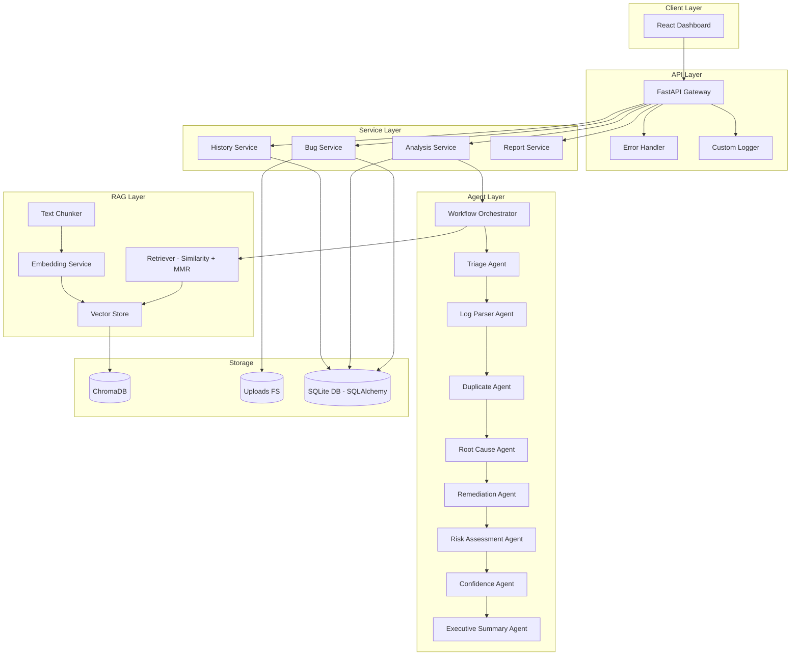
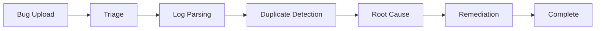
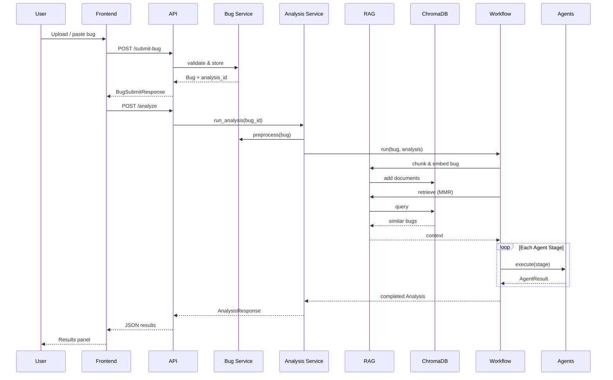
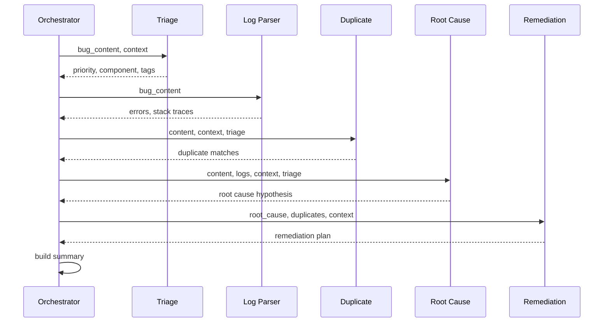
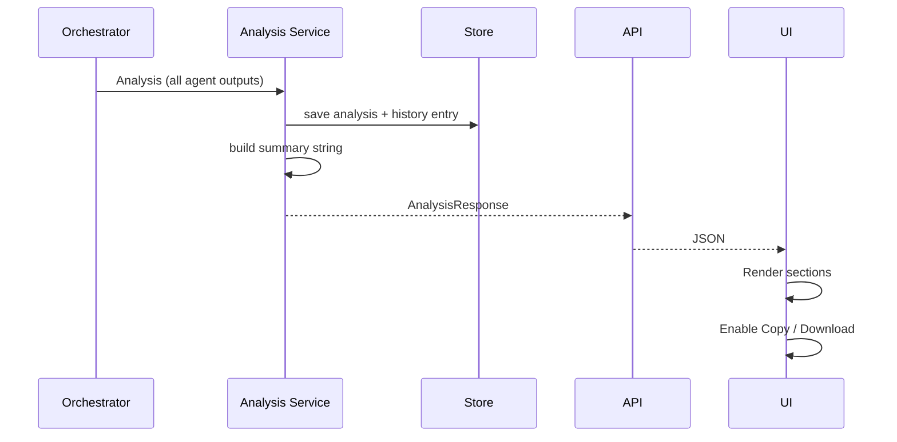
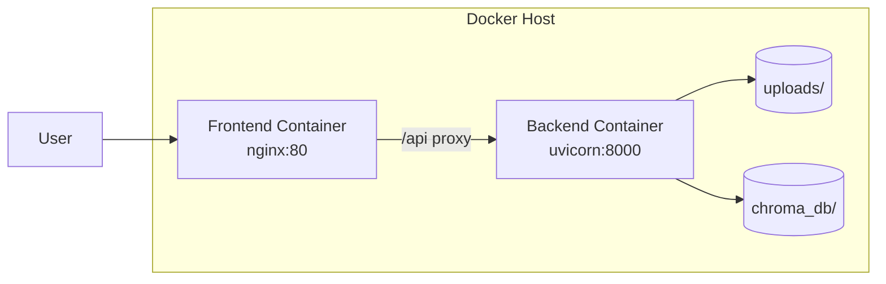
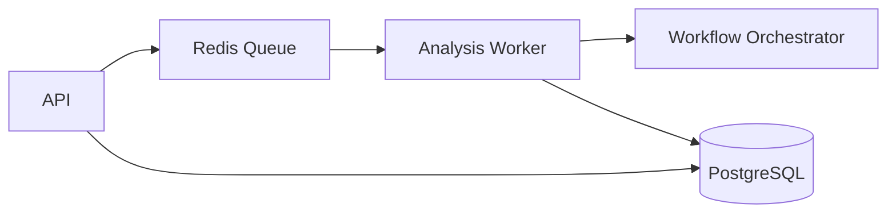
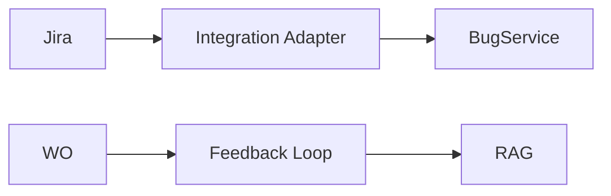

# AI-Smart-Bug-Analyzer-And-Fix-Advisor System Architecture

## 1. Introduction

AI-Smart-Bug-Analyzer-And-Fix-Advisor (AI Smart Bug Analyzer and Fix Advisor) is an intelligent bug analysis platform that combines Retrieval-Augmented Generation (RAG) with a multi-agent orchestration pipeline to triage bugs, detect duplicates, identify root causes, and recommend remediation steps.

This document describes the system design, component interactions, data flows, and extension points for Milestones 2–4.

---

## 2. Architecture Overview



---

## 3. Component Design

### 3.1 API Layer (`backend/app/api/`)

| Endpoint | Method | Handler | Description |
|----------|--------|---------|-------------|
| `/submit-bug` | POST | `submit_bug` | Accepts multipart file or form content |
| `/analyze` | POST | `analyze_bug` | Triggers DAG workflow |
| `/history` | GET | `get_history` | Paginated history |
| `/health` | GET | `health_check` | Liveness |
| `/status` | GET | `system_status` | Dependency health |

**Cross-cutting concerns:**
- Centralized exception handling via `register_exception_handlers()`
- Structured logging via Python `logging` module with rotating file handler
- Configuration via `pydantic-settings` reading `.env`

### 3.2 Domain Models (`backend/app/models/`)

| Model | Key Fields |
|-------|------------|
| `Bug` | id, title, raw_content, metadata, status |
| `BugMetadata` | bug_id, priority, component, resolution, source, date, tags |
| `Analysis` | bug_id, triage, log_analysis, duplicate_detection, root_cause, remediation |
| `HistoryEntry` | bug_id, analysis_id, title, priority, summary |
| `AppSettings` | embedding_model, chunk_size, retrieval params |

### 3.3 RAG Pipeline (`backend/app/rag/`)

#### Embedding Model
- **Model:** `sentence-transformers/all-MiniLM-L6-v2`
- **Dimensions:** 384
- **Usage:** Query and document embedding for cosine similarity in ChromaDB

#### Text Chunking
- **Splitter:** `RecursiveCharacterTextSplitter`
- **chunk_size:** 512 (configurable via `.env`)
- **chunk_overlap:** 64

#### Metadata Schema (stored in ChromaDB)
| Field | Type | Description |
|-------|------|-------------|
| bug_id | string | Unique bug identifier |
| priority | string | critical/high/medium/low |
| component | string | Affected module |
| resolution | string | Historical fix description |
| source | string | user_upload, seed, integration |
| date | string | ISO timestamp |
| tags | string | Comma-separated tags |

#### Retrieval Strategies

1. **Similarity Search** – Standard cosine distance query, returns top-K nearest neighbors.
2. **MMR (Maximum Marginal Relevancy)** – Balances relevance vs. diversity using lambda parameter (default 0.7).

### 3.4 Agent Workflow (`backend/app/agents/`)

DAG execution order (strictly sequential):



| Agent | Prompt Template | Input | Output |
|-------|----------------|-------|--------|
| TriageAgent | `prompts/triage.txt` | bug content, RAG context | priority, component, tags |
| LogParserAgent | — (regex-based) | bug content | errors, stack traces, HTTP codes |
| DuplicateAgent | `prompts/duplicate.txt` | content, context, triage | is_duplicate, matches |
| RootCauseAgent | `prompts/rootcause.txt` | content, logs, context | hypothesis, category |
| RemediationAgent | `prompts/remediation.txt` | root cause, duplicates | fix plan, effort estimate |

### 3.5 Service Layer (`backend/app/services/`)

- **BugService** – Validation, file upload, preprocessing
- **AnalysisService** – Orchestrates workflow, records history
- **HistoryService** – Read-only history queries
- **InMemoryStore** – MVP persistence (replaceable in Milestone 2)

---

## 4. Data Flow

### 4.1 Submit & Analyze Flow



### 4.2 Agent Workflow Detail



### 4.3 Result Generation Flow



---

## 5. Error Handling Architecture

| Error Type | HTTP Code | error_code | Trigger |
|------------|-----------|------------|---------|
| ValidationError | 422 | VALIDATION_ERROR | Empty content, bad file type/size |
| NotFoundError | 404 | NOT_FOUND | Unknown bug/analysis ID |
| ServiceUnavailableError | 503 | SERVICE_UNAVAILABLE | ChromaDB down |
| EmbeddingError | 503 | EMBEDDING_ERROR | Model load/generation failure |
| LLMTimeoutError | 504 | LLM_TIMEOUT | LLM call exceeds timeout |
| Unhandled | 500 | INTERNAL_ERROR | Unexpected exceptions |

All errors return consistent JSON:

```json
{
  "success": false,
  "error_code": "VALIDATION_ERROR",
  "message": "Human-readable message",
  "details": {}
}
```

---

## 6. Configuration Management

All settings loaded from `.env` via `pydantic-settings`:

| Variable | Default | Purpose |
|----------|---------|---------|
| EMBEDDING_MODEL | all-MiniLM-L6-v2 | Sentence transformer model |
| CHUNK_SIZE | 512 | Text splitter chunk size |
| CHUNK_OVERLAP | 64 | Overlap between chunks |
| CHROMA_PERSIST_DIR | chroma_db | Vector store path |
| RETRIEVAL_TOP_K | 5 | Documents retrieved |
| MMR_LAMBDA | 0.7 | MMR diversity parameter |
| MAX_UPLOAD_SIZE_MB | 10 | File size limit |

---

## 7. Deployment Architecture



- **Dockerfile:** `docker/Dockerfile` – Python 3.11 slim, installs requirements, runs uvicorn
- **docker-compose.yml:** Backend + frontend with health checks and volume mounts
- **CI:** GitHub Actions runs pytest on push/PR

---

## 8. Testing Strategy

| Suite | Location | Coverage |
|-------|----------|----------|
| API tests | `tests/test_api.py` | All endpoints, submit→analyze flow |
| RAG tests | `tests/test_rag.py` | Chunking, retrieval strategies |

Run: `cd backend && pytest tests/ -v`

---

## 9. Future Milestone Integration (No Structural Changes)

### Milestone 2 – Async + Database



- Replace `InMemoryStore` with SQLAlchemy repositories implementing same interface
- Move `run_analysis()` to background worker; add `GET /analysis/{id}/status`
- Agent and RAG modules unchanged

### Milestone 3 – Kubernetes + Observability

- Helm chart wraps existing Docker images
- OpenTelemetry spans injected at orchestrator stage boundaries
- ChromaDB → managed vector DB via config swap in `VectorStore`

### Milestone 4 – Enterprise Integrations



- New `/services/integrations/` adapters feed `BugService.create_bug_from_text()`
- SSO middleware added at API layer only
- Fine-tuned embeddings configured via `EMBEDDING_MODEL` env var

---

## 10. Security Considerations

- File upload validation (extension whitelist, size limit)
- CORS restricted to configured origins
- Secrets via `.env` (never committed)
- Upload directory outside web root
- Optional LLM API key for production agent reasoning

---

## 11. Directory Reference

| Path | Responsibility |
|------|----------------|
| `backend/app/api/` | HTTP routes |
| `backend/app/services/` | Business logic |
| `backend/app/models/` | Domain entities |
| `backend/app/schemas/` | API contracts |
| `backend/app/agents/` | Agent implementations + orchestrator |
| `backend/app/rag/` | Embeddings, chunking, vector store, retrieval |
| `backend/app/config/` | Settings |
| `backend/app/utils/` | Logging, exceptions |
| `backend/prompts/` | LLM prompt templates |
| `backend/tests/` | pytest |
| `frontend/` | React UI |
| `docs/` | Documentation |
| `docker/` | Container definitions |
| `scripts/` | Seed and utility scripts |
| `.github/` | CI workflows |
