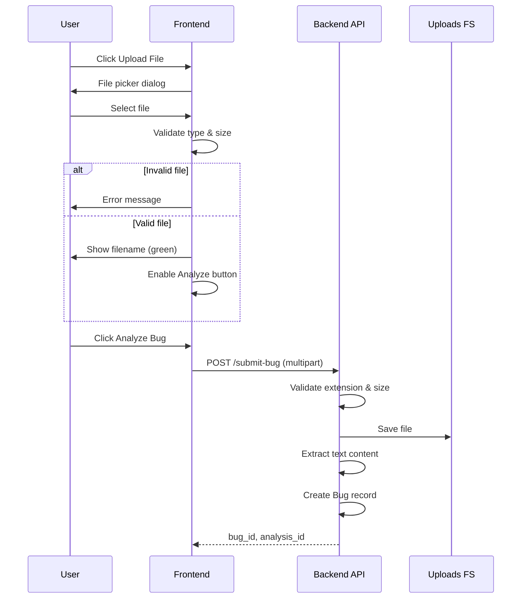
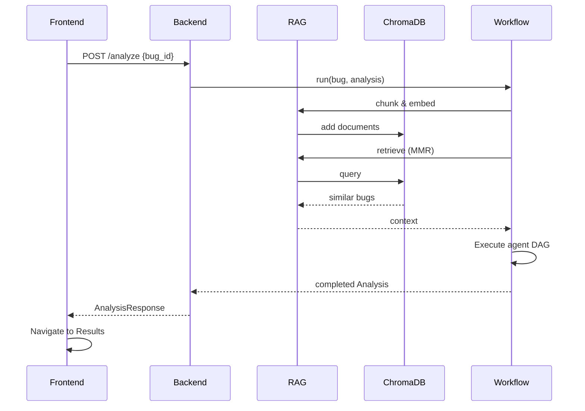
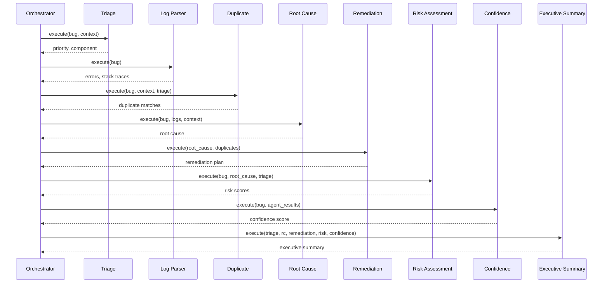
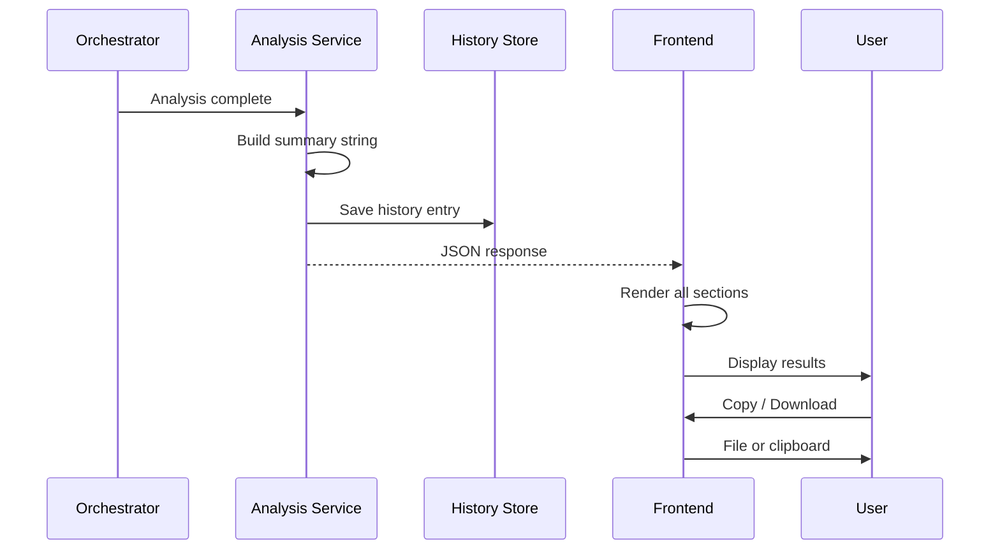

# AI-Smart-Bug-Analyzer-And-Fix-Advisor User Manual

**AI Smart Bug Analyzer and Fix Advisor**

Version 1.0.0 | Infosys AI-Smart-Bug-Analyzer-And-Fix-Advisor Project

---

## Table of Contents

1. [Introduction](#1-introduction)
2. [Application Startup](#2-application-startup)
3. [Dashboard Overview](#3-dashboard-overview)
4. [Complete User Journey](#4-complete-user-journey)
5. [Button-by-Button Behaviour](#5-button-by-button-behaviour)
6. [Backend Processing Flow](#6-backend-processing-flow)
7. [Error Handling](#7-error-handling)
8. [UI States](#8-ui-states)
9. [Screens](#9-screens)
10. [Sequence Diagrams](#10-sequence-diagrams)
11. [Future Workflow Integration](#11-future-workflow-integration)

---

## 1. Introduction

AI-Smart-Bug-Analyzer-And-Fix-Advisor helps developers and QA engineers analyze bug reports using AI. You can paste a stack trace, upload a log file, and receive structured analysis including triage classification, duplicate detection, root cause hypothesis, and remediation recommendations.

This manual describes **exactly what happens** after every user interaction — from opening the browser to downloading the final report.

---

## 2. Application Startup

### 2.1 Starting the Backend Server

```bash
cd backend
python -m venv .venv
.venv\Scripts\activate        # Windows
pip install -r requirements.txt
uvicorn app.main:app --reload --host 0.0.0.0 --port 8000
```

**What initializes on startup:**

| Service | Action | User-visible effect |
|---------|--------|---------------------|
| **FastAPI** | Binds to port 8000, registers routes | API available at `/api/v1/*` |
| **Logging** | Creates `logs/ai-smart-bug-analyzer-and-fix-advisor.log`, console output | Server logs in terminal |
| **Embedding Model** | Lazy-loads `all-MiniLM-L6-v2` | First analysis may take longer |
| **ChromaDB** | Opens/creates `chroma_db/` directory | Historical bug retrieval enabled |

Verify: open http://localhost:8000/api/v1/health → `{"status": "healthy"}`

### 2.2 Starting the Frontend

```bash
cd frontend
npm install
npm run dev
```

**What initializes:**
- Vite dev server on port 5173
- API proxy to backend (`/api` → `localhost:8000`)
- React application mounts to `#root`

### 2.3 First-Time User Experience

When you open http://localhost:5173 for the first time:

1. The **Dashboard** screen loads.
2. The sidebar shows **AI-Smart-Bug-Analyzer-And-Fix-Advisor Status: checking**.
3. The frontend calls `GET /api/v1/status`.
4. Status cards populate: embedding model, ChromaDB, document count.
5. Sidebar status changes to **Ready** (green dot) if all services are healthy, or **degraded** (amber) if ChromaDB/embeddings are unavailable.
6. The Upload Card is visible with an empty paste area and disabled-looking Analyze button (no input yet).
7. History panel is empty until first analysis.

---

## 3. Dashboard Overview

### 3.1 Sidebar

| Element | Description |
|---------|-------------|
| **Brand header** | "AI-Smart-Bug-Analyzer-And-Fix-Advisor – Bug Analyzer" |
| **Navigation items** | Dashboard, Upload, Analysis, Results, History, Settings |
| **Active highlight** | Current screen highlighted in slate background |
| **Status indicator** | Bottom of sidebar: colored dot + "AI-Smart-Bug-Analyzer-And-Fix-Advisor Status: ready/degraded/unavailable" |

**Behaviour:** Clicking any nav item switches the main content area without page reload.

### 3.2 Navigation

Routes are client-side (React state). No full page navigation occurs.

### 3.3 Upload Card

| Element | Description |
|---------|-------------|
| **Upload File button** | Opens native file picker |
| **File name display** | Shows selected filename after validation |
| **Paste area** | Multi-line textarea for bug text |
| **Analyze Bug button** | Primary action – starts pipeline |
| **Clear button** | Resets form |

### 3.4 Paste Bug Report Area

- Accepts plain text, stack traces, JSON logs, XML snippets.
- Minimum 1 non-whitespace character required.
- Placeholder text guides user input.

### 3.5 Analysis Button

- Label changes: "Analyze Bug" → "Analyzing..." during processing.
- Disabled when: no valid input, or analysis in progress.

### 3.6 Status Indicators

Grid of cards showing:
- **System Status** – overall ready/degraded
- **embedding_model** – ready/unavailable
- **chromadb** – ready/unavailable + document count
- **Indexed Bugs** – total ChromaDB documents
- **Total Submissions** – bugs submitted this session

Refreshes every 30 seconds automatically.

### 3.7 Results Panel

Displays after analysis:
- Summary line (priority, component, root cause, effort)
- Expandable JSON sections: Triage, Log Analysis, Duplicate Detection, Root Cause, Remediation
- Copy Findings and Download Report buttons

### 3.8 History Panel

Table columns: Title, Priority, Component, Status, Date.
Populated from `GET /api/v1/history` after each completed analysis.

### 3.9 Settings

Read-only display of:
- Embedding model, chunk size/overlap, retrieval top-K, MMR lambda
- Max upload size, allowed extensions, LLM model

---

## 4. Complete User Journey

### Step-by-step chronological flow:

| Step | Actor | Action | System Response |
|------|-------|--------|-----------------|
| 1 | User | Opens http://localhost:5173 | Dashboard renders |
| 2 | Frontend | Calls `GET /api/v1/status` | Health data returned |
| 3 | UI | Status → "Ready" | Green indicator in sidebar |
| 4 | User | Pastes bug report OR clicks Upload | Input captured |
| 5 | Frontend | Validates input locally | Enables Analyze button |
| 6 | User | Clicks **Analyze Bug** | UI state → uploading |
| 7 | Frontend | `POST /api/v1/submit-bug` | Bug stored, analysis_id returned |
| 8 | Frontend | `POST /api/v1/analyze` | UI state → processing |
| 9 | Backend | Preprocesses bug content | Whitespace normalized |
| 10 | Backend | Chunks text (512/64) | Chunks created |
| 11 | Backend | Generates embeddings | Vectors via MiniLM |
| 12 | Backend | Indexes chunks in ChromaDB | Documents added |
| 13 | Backend | MMR retrieval | Similar historical bugs fetched |
| 14 | Backend | Triage Agent runs | Priority, component assigned |
| 15 | Backend | Log Parser Agent runs | Errors, stack traces extracted |
| 16 | Backend | Duplicate Agent runs | Similarity matches computed |
| 17 | Backend | Root Cause Agent runs | Hypothesis generated |
| 18 | Backend | Remediation Agent runs | Fix plan created |
| 19 | Backend | Combines results, saves history | AnalysisResponse JSON |
| 20 | Frontend | Receives response | UI state → completed |
| 21 | Frontend | Navigates to Results | Results panel populated |
| 22 | User | Reviews findings | — |
| 23 | User | Downloads report / copies / views history | Action completed |

---

## 5. Button-by-Button Behaviour

### 5.1 Upload Button

| Aspect | Detail |
|--------|--------|
| **Purpose** | Select a bug report file from disk |
| **Validation** | Extensions: `.txt`, `.log`, `.json`, `.xml`, `.pdf`; max 10 MB |
| **Backend API** | None (local only until Analyze) |
| **Loading state** | File picker modal open |
| **Success state** | Filename displayed in green; upload message shown |
| **Failure state** | Red error alert: unsupported type or size exceeded |
| **UI after completion** | Analyze button enabled if file OR paste content exists |

### 5.2 Analyze Bug Button

| Aspect | Detail |
|--------|--------|
| **Purpose** | Submit bug and run full AI analysis pipeline |
| **Validation** | Requires non-empty paste OR valid uploaded file |
| **Backend API** | `POST /api/v1/submit-bug` then `POST /api/v1/analyze` |
| **Loading state** | Label "Analyzing...", spinner, inputs disabled |
| **Success state** | Toast "Analysis completed", auto-navigate to Results |
| **Failure state** | Toast with error message, UI state → error, inputs re-enabled |
| **UI after completion** | Results panel shows all agent outputs |

### 5.3 Download Report Button

| Aspect | Detail |
|--------|--------|
| **Purpose** | Save analysis as text file |
| **Validation** | Requires completed analysis in Results panel |
| **Backend API** | None (client-side generation) |
| **Loading state** | Instant |
| **Success state** | File `ai-smart-bug-analyzer-and-fix-advisor-report-{id}.txt` downloaded |
| **Failure state** | N/A (no analysis = button not visible) |
| **UI after completion** | Toast "Report downloaded" |

### 5.4 Copy Findings Button

| Aspect | Detail |
|--------|--------|
| **Purpose** | Copy formatted report to clipboard |
| **Validation** | Requires completed analysis |
| **Backend API** | None |
| **Loading state** | Instant |
| **Success state** | Toast "Findings copied to clipboard" |
| **Failure state** | Browser clipboard permission denied |
| **UI after completion** | No layout change |

### 5.5 Clear Button

| Aspect | Detail |
|--------|--------|
| **Purpose** | Reset upload form for new analysis |
| **Validation** | None |
| **Backend API** | None |
| **Loading state** | None |
| **Success state** | Textarea empty, file cleared, messages removed |
| **Failure state** | N/A |
| **UI after completion** | Analyze button disabled until new input |

### 5.6 Sidebar Navigation Buttons

| Button | Navigates to | API called on entry |
|--------|--------------|---------------------|
| Dashboard | Combined status + upload + results | `GET /status` |
| Upload | Upload card only | — |
| Analysis | Progress indicator | — |
| Results | Results panel | — |
| History | History table | `GET /history` |
| Settings | Settings display | `GET /settings` |

---

## 6. Backend Processing Flow

After clicking **Analyze Bug**, the backend executes:

### 6.1 File Upload (if applicable)
- Read multipart bytes
- Validate extension against whitelist
- Validate size ≤ 10 MB
- Save to `uploads/{uuid}_{filename}`
- Extract text (PDF requires optional `pypdf`)

### 6.2 Validation
- Reject empty content (422)
- Reject unsupported extensions (422)

### 6.3 Parsing
- Read file content as UTF-8 (replace errors)
- Detect format: JSON, XML, structured log, plain text

### 6.4 Cleaning
- Strip empty lines
- Normalize whitespace in `BugService.preprocess()`

### 6.5 Chunking
- `RecursiveCharacterTextSplitter`: chunk_size=512, overlap=64
- Attach metadata: bug_id, priority, component, resolution, source, date, tags

### 6.6 Embedding Generation
- `all-MiniLM-L6-v2` encodes each chunk → 384-dim vector

### 6.7 Vector Storage
- Chunks added to ChromaDB collection `ai_smart_bug_analyzer_and_fix_advisor_bugs`

### 6.8 Vector Retrieval
- Query embedding generated from full bug content
- MMR retrieval (λ=0.7) or similarity search
- Top-K (default 5) historical chunks returned

### 6.9 Multi-Agent Execution

| Order | Agent | Duration tracked |
|-------|-------|------------------|
| 1 | TriageAgent | Yes (ms) |
| 2 | LogParserAgent | Yes |
| 3 | DuplicateAgent | Yes |
| 4 | RootCauseAgent | Yes |
| 5 | RemediationAgent | Yes |

### 6.10 Final Response Generation
- All agent outputs merged into `Analysis` model
- Summary string built: `Priority | Component | Root Cause | Fix Effort`
- History entry created
- JSON returned to frontend

---

## 7. Error Handling

### 7.1 Invalid File Uploaded

| Layer | Behaviour |
|-------|-----------|
| Frontend | Immediate error: "Unsupported file type" |
| Backend | 422 VALIDATION_ERROR if bypassed |

### 7.2 File Too Large

| Layer | Behaviour |
|-------|-----------|
| Frontend | Error: "File exceeds 10 MB limit" |
| Backend | 422 with max_mb in details |

### 7.3 Empty Bug Report

| Layer | Behaviour |
|-------|-----------|
| Frontend | Analyze button remains disabled |
| Backend | 422 "Bug report content cannot be empty" |

### 7.4 ChromaDB Unavailable

| Layer | Behaviour |
|-------|-----------|
| Status | Shows "degraded" / chromadb "unavailable" |
| Analysis | 503 SERVICE_UNAVAILABLE |
| UI | Error toast; user can retry when service recovers |

### 7.5 Embedding Model Fails

| Layer | Behaviour |
|-------|-----------|
| Status | embedding_model "unavailable" |
| Analysis | 503 EMBEDDING_ERROR |
| UI | Error toast with message |

### 7.6 LLM Timeout

| Layer | Behaviour |
|-------|-----------|
| Backend | 504 LLM_TIMEOUT (when LLM provider configured) |
| Fallback | Heuristic agents continue without LLM |
| UI | Partial results or error toast |

### 7.7 Backend Unavailable

| Layer | Behaviour |
|-------|-----------|
| Frontend | Status → "unavailable", fetch errors |
| UI | Red sidebar indicator; actions fail with network error |

### 7.8 Network Disconnected

| Layer | Behaviour |
|-------|-----------|
| Frontend | Fetch throws; error toast displayed |
| UI | Processing state reverts to error; user can retry |

---

## 8. UI States

| State | Visual Indicators | User Actions Available |
|-------|-------------------|------------------------|
| **Idle** | Default form, no spinner | Paste, upload, navigate |
| **Uploading** | "Submitting bug report..." message | None (brief) |
| **Processing** | "Analyzing...", disabled inputs | Cancel not available (MVP) |
| **Success** | Green toast, Results populated | Copy, download, new analysis |
| **Warning** | Amber status (degraded services) | Submit allowed; retrieval may be limited |
| **Error** | Red toast/alert | Clear, retry, edit input |
| **Completed** | Results panel fully rendered | All post-analysis actions |

---

## 9. Screens

### 9.1 Dashboard

**Purpose:** Primary landing screen combining status, upload, and latest results.

**Components:** Status grid, Upload card, Results panel (if prior analysis exists).

**Entry:** Default on app load.

### 9.2 Upload

**Purpose:** Focused bug submission without distractions.

**Components:** Upload card only.

**Entry:** Sidebar → Upload.

### 9.3 Analysis

**Purpose:** Show in-progress pipeline status.

**Components:** Spinner during processing; instructional text when idle.

**Entry:** Sidebar → Analysis (auto during processing).

### 9.4 Results

**Purpose:** Display completed analysis.

**Components:** Summary, agent sections, Copy/Download buttons.

**Entry:** Auto after analysis OR Sidebar → Results.

### 9.5 History

**Purpose:** Browse past analyses.

**Components:** Sortable table with priority badges.

**Entry:** Sidebar → History.

### 9.6 Settings

**Purpose:** View system configuration.

**Components:** Key-value settings list (read-only in MVP).

**Entry:** Sidebar → Settings.

---

## 10. Sequence Diagrams

### 10.1 Upload Flow



### 10.2 Analysis Flow



### 10.3 Agent Workflow



### 10.4 Result Generation



---

## 11. Future Workflow Integration

### Milestone 2 – Async Analysis & Database

**User-visible changes:**
- Analyze returns immediately with `analysis_id`
- Progress bar polls `GET /analysis/{id}/status`
- History persists across server restarts

**Architecture impact:** None on UI contract. Backend swaps in-memory store for PostgreSQL; workflow orchestrator unchanged.

### Milestone 3 – Multi-Instance & Monitoring

**User-visible changes:**
- Faster analysis under load
- Admin dashboard with latency metrics

**Architecture impact:** Kubernetes scales backend pods; ChromaDB replaced via config. Frontend API URL unchanged.

### Milestone 4 – Jira/ADO Integration

**User-visible changes:**
- "Import from Jira" button on Upload screen
- "Push to Jira" on Results panel
- SSO login screen

**Architecture impact:** New integration service plugs into existing `BugService` and `AnalysisService`. Agent DAG and RAG pipeline unchanged.

---

## Appendix: Supported File Types

| Extension | Handling |
|-----------|----------|
| `.txt` | Direct text read |
| `.log` | Direct text read |
| `.json` | Direct text read |
| `.xml` | Direct text read |
| `.pdf` | Text extraction (requires `pypdf`) |

Maximum file size: **10 MB** (configurable via `MAX_UPLOAD_SIZE_MB`).

---

*End of User Manual*
